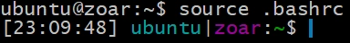

Hay mucha gente que simplemente les gusta personalizar la apariencia del terminal, es mi caso. Cuando usas una línea de comandos durante mucho tiempo, normalmente ayuda tener un prompt más visible que el que viene por defecto.

## Backup

Lo primero, debes de hacer un backup del fichero de configuración para poder dar marcha atrás en caso de que sea necesario. El fichero está en el $HOMe del usuario, así que lo primero es ir a ese directorio.

```
cd ~
cp -p .bashrc .bashrc-backup
```

## Añadiendo la nueva configuración

Ahora, es el momento de editar el fichero .bashrc y añadir la nueva configuración para tener un prompt personalizado.

Yo suelo utilizar el editor _vi_ para modificar la configuración.

    vi .bashrc

Una vez abierto el fichero, deberías ir al final del fichero. La forma de hacerlo en vi es utilizando la combinación "Shift+G". Una vez que el cursor esté posicionado al final, empieza a editar en _vi_ usando la tecla "o". Añade la siguiente configuración al final del fichero.

```
########################################
# background color using ANSI escape
########################################
bgBlack="\[$(tput setab 0)\]" # black
bgRed="\[$(tput setab 1)\]" # red
bgGreen="\[$(tput setab 2)\]" # green
bgYellow="\[$(tput setab 3)\]" # yellow
bgBlue="\[$(tput setab 4)\]" # blue
bgMagenta="\[$(tput setab 5)\]" # magenta
bgCyan="\[$(tput setab 6)\]" # cyan
bgWhite="\[$(tput setab 7)\]" # white


########################################
# foreground color using ANSI escape
########################################
fgBLack="\[$(tput setaf 0)\]" # black
fgRed="\[$(tput setaf 1)\]" # red
fgGreen="\[$(tput setaf 2)\]" # green
fgYellow="\[$(tput setaf 3)\]" # yellow
fgBlue="\[$(tput setaf 4)\]" # blue
fgMagenta="\[$(tput setaf 5)\]" # magenta
fgCyan="\[$(tput setaf 6)\]" # cyan
fgWhite="\[$(tput setaf 7)\]" # white


########################################
# text editing options
########################################
txBold="\[$(tput bold)\]"   # bold
txHalf="\[$(tput dim)\]"    # half-bright
txUnderline="\[$(tput smul)\]"   # underline
txEndUnder="\[$(tput rmul)\]"   # exit underline
txReverse="\[$(tput rev)\]"    # reverse
txStandout="\[$(tput smso)\]"   # standout
txEndStand="\[$(tput rmso)\]"   # exit standout
txReset="\[$(tput sgr0)\]"   # reset attributes

# root
PS1="[\t] $fgRed\u$txReset|$fgYellow\h$txReset:$fgCyan\W$txReset\$ "

# user
PS1="[\t] $fgCyan\u$txReset|$fgMagenta\h$txReset:$fgGreen\w$txReset\$ "
```

El último comando "PS1=..." es la definición del prompt. En esta línea podría cambiar las variables de color como quieras.

Una vez finalizada la edición del fichero, debería salir del modo de edición de vi (ESC) y salvar el fichero (:wq).

## Actualizar el prompt actual

Para actualizar el prompt en tu terminal actual, deberías de ejecutar el comando _source_.

    source .bashrc

Y esto es, ahora podrás tener tu terminal personalizada.



## Marcha atrás a la configuración

Para volver a la configuración previa, tienes que copiar el fichero de backup.

```
cd ~
cp .bashrc-backup .bashrc
```
