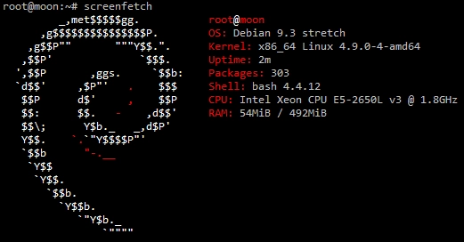
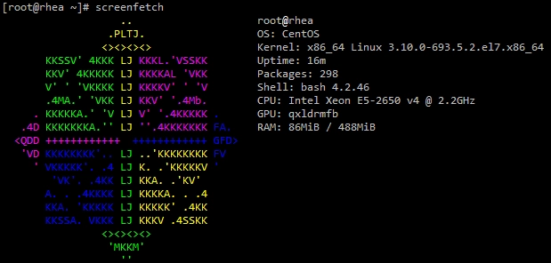

**screenFetch** es un software para GNU/Linux que muestra información relacionada con nuestro Hardware y nuestro Sistema Operativo, incluyendo el logo de la distribución de Linux que está siendo utilizada. Esto es lo que la info de screenFetch muestra:

*   User Name
*   Host Name
*   OS with Code Name
*   Installed Kernel Info
*   System Uptime
*   List of Installed Packages
*   bash Shell Version
*   System Resolution
*   DE (Desktop Environment)
*   WM (Window Manager)
*   WM Theme
*   GTK Theme
*   Icon Theme
*   Font
*   CPU
*   RAM Usage

Aquí algunos ejemplos:

 

 

## Instalar screenFetch en cualquier Distro Linux

screeenFetch se puede utilizar en un montón de distros GNU/Linux, y mayormente todas ellas tienen este software en sus repositorios de software. Para instalarlo, tiene que abrir el terminal y ejecutar esto: **Debian / Ubuntu / Linux Mint...**

```
sudo apt update
sudo apt install screenfetch
```

### CentOS

    sudo curl -o /usr/local/bin/screenfetch https://raw.githubusercontent.com/KittyKatt/screenFetch/master/screenfetch-dev && sudo chmod +x /usr/local/bin/screenfetch

### Suse / OpenSuse

    sudo zypper install screenfetch

### Arch Linux

    sudo pacman -S screenfetch

### Fedora

    sudo dnf install screenfetch

### FreeBSD

    sudo pkg install screenfetch

## Añadir screenFetch al inicio de sesión de usuario

Para añadir screenFetch en el inicio de sesión de usuario, debes de editar el fichero `/etc/bash.bashrc`, y añadir la siguiente línea al final:

    if [ -f /usr/bin/screenfetch ]; then screenfetch; fi

También es posible configurar la salida de este software.

#### Para quitar cualquier color de la salida:

    screenfetch -N

#### Para no monstrar el logo ASCII de la distro:

    screenfetch -n

#### Para monstrar sólo el logo de la distribución ASCII:

    screenfetch -L
