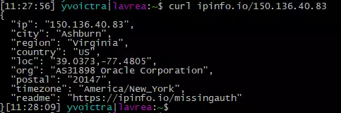

**La línea de comandos de Linux es una gran herramienta**. Hoy me gustaría compartir un método para obtener la informción geográfica de una IP con un comando, utilizando cURL y la herramienta de [ipinfo.io](https://ipinfo.io).

Es tan sencillo como usar este comando:

    $ curl ipinfo.io/<IP Address>

Aquí tienes un ejemplo:

Obtendrás estos parámetros:

*   IP
*   Ciudad
*   Región
*   País
*   Loc (Coordenadas)
*   Org
*   Código Postal
*   Zona Horaria

Y esto es todo. Si quieres tener más información sobre una dirección IP, podría visitar la web de [ipinfo.io](https://ipinfo.io), y obtendrás más información y herramientas.
