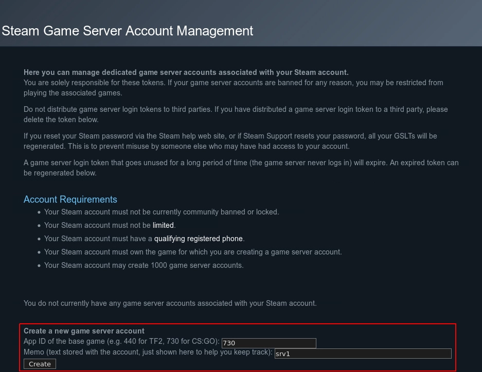

Some people are interested in have a private server in order to play CS GO (Counter-Strike: Global Offensive) with their friends. The process is easy to follow.

## What is needed?

-   A server 
       - **Memory**: At least 2GB RAM (I recommend 4GB)
       - **Disk**: At least 15 GB os disk space
       - **CPU architecture**: x86 (ARM not supported)
-   A Valve account 

## Create a new user

First of all, it is important to create a new user in Linux in order to prevent CS GO server possible hacking to affect your Linux node.

```
root|venice:~$ adduser csgo
Adding user `csgo' ...
Adding new group `csgo' (1001) ...
Adding new user `csgo' (1001) with group `csgo' ...
New password: 
Retype new password: 
passwd: password updated successfully
Changing the user information for csgo
Enter the new value, or press ENTER for the default
        Full Name []: 
        Room Number []: 
        Work Phone []: 
        Home Phone []: 
        Other []: 
Is the information correct? [Y/n] y
```

Once created the user, log in a new session with this user.

```
root|venice:~$ su - csgo
csgo|venice:~$ 
```

## SteamCMD

SteamCMD is a command-line version of the Steam client which is needed if you intend to host a Steam game on your own game server.

### Install SteamCMD

The first step is to install the headers and static library files necessary for building C programs. After this, we can install SteamCMD.


```
csgo|venice:~$ sudo apt-get install lib32gcc-s1

csgo|venice:~$ `mkdir ~/Steam && cd ~/Steam`

csgo|venice:~$ wget https://steamcdn-a.akamaihd.net/client/installer/steamcmd\_linux.tar.gz

csgo|venice:~/Steam$ tar -xvzf steamcmd\_linux.tar.gz
steamcmd.sh
linux32/steamcmd
linux32/steamerrorreporter
linux32/libstdc++.so.6
linux32/crashhandler.so
csgo|venice:~/Steam$
```

### RUN SteamCMD

Next step is tou run SteamCMD in order to install the CS GO server.

```
csgo|venice:~/Steam$ screen ~/Steam/steamcmd.sh
[ 17%] Downloading update (11.480 of 51.570 KB)…
[ 22%] Downloading update (13.925 of 51.570 KB)…
[ 27%] Downloading update (16.377 of 51.570 KB)…
[ 31%] Downloading update (18.822 of 51.570 KB)…
[ 36%] Downloading update (21.309 of 51.570 KB)…
[ 41%] Downloading update (23.810 of 51.570 KB)…
[ 46%] Downloading update (26.307 of 51.570 KB)…
[ 51%] Downloading update (29.064 of 51.570 KB)…
[ 56%] Downloading update (31.598 of 51.570 KB)…
[ 61%] Downloading update (32.848 of 51.570 KB)…
[ 63%] Downloading update (34.093 of 51.570 KB)…
[ 66%] Downloading update (35.341 of 51.570 KB)…
[ 68%] Downloading update (36.583 of 51.570 KB)…
[ 70%] Downloading update (37.959 of 51.570 KB)…
[ 73%] Downloading update (39.206 of 51.570 KB)…
[ 76%] Downloading update (40.447 of 51.570 KB)…
[ 78%] Downloading update (41.699 of 51.570 KB)…
[ 80%] Downloading update (43.080 of 51.570 KB)…
[ 83%] Downloading update (44.342 of 51.570 KB)…
[ 85%] Downloading update (45.594 of 51.570 KB)…
[ 88%] Downloading update (46.847 of 51.570 KB)…
[ 90%] Downloading update (48.229 of 51.570 KB)…
[ 93%] Downloading update (49.479 of 51.570 KB)…
[ 95%] Downloading update (50.723 of 51.570 KB)…
[ 98%] Downloading update (51.570 of 51.570 KB)…
[100%] Download Complete.
[----] Applying update…
[----] Extracting package…
[----] Extracting package…
[----] Extracting package…
[----] Extracting package…
[----] Installing update…
[----] Installing update…
[----] Installing update…
[----] Installing update…
[----] Installing update…
[----] Installing update…
[----] Installing update…
[----] Installing update…
[----] Cleaning up…
[----] Update complete, launching…
Redirecting stderr to '/home/csgo/Steam/logs/stderr.txt'
/tmp/dumps insufficient permissions - delete and recreate
[ 0%] Checking for available updates…
[----] Verifying installation…
[ 0%] Downloading update…
[ 0%] Checking for available updates…
[----] Download complete.
[----] Extracting package…
[----] Extracting package…
[----] Extracting package…
[----] Extracting package…
[----] Installing update…
[----] Installing update…
[----] Installing update…
[----] Installing update…
[----] Installing update…
[----] Installing update…
[----] Installing update…
[----] Installing update…
[----] Cleaning up…
[----] Update complete, launching Steamcmd…
Redirecting stderr to '/root/Steam/logs/stderr.txt'
[ 0%] Checking for available updates…
[----] Verifying installation…
Steam Console Client (c) Valve Corporation
-- type 'quit' to exit --
Loading Steam API…OK.

Steam>
```

Once started SteamCMD, we have to login Steam. It could be anonymously, for the installation is enough.

```
Steam>login anonymous

Connecting anonymously to Steam Public…Logged in OK
Waiting for user info…OK

Steam>
```

Next step is to select the installation directory (In our case _/home/csgo/csgo-ds_)

```
Steam>force_install_dir ./csgo-ds
```

And finally, the command to install CS GO server from SteamCMD.

```
Steam>app_update 740 validate
Update state (0x3) reconfiguring, progress: 0.00 (0 / 0)
Update state (0x3) reconfiguring, progress: 0.00 (0 / 0)
Update state (0x61) downloading, progress: 0.09 (23907768 / 27757647100)
Update state (0x61) downloading, progress: 0.30 (83559997 / 27757647100)
...
Update state (0x61) downloading, progress: 99.73 (27683929580 / 27757647100)
Update state (0x61) downloading, progress: 99.82 (27706657340 / 27757647100)
Update state (0x61) downloading, progress: 99.95 (27742929007 / 27757647100)
Success! App '740' fully installed.
Steam>quit
csgo|venice:~/Steam$ 
```

## First start of your CS GO server

Now the Counter-Strike: Global Offensive has been succesfully installed and we can do a test run. With the next command we will start the server with the mode _Classic Casual_ and the Mapgroup _mg\_bomb_ iniciando el mapa _de\_mirage_.

```
csgo|venice:~/Steam$ cd csgo-ds
csgo|venice:~/Steam/csgo-ds$ ./srcds_run -game csgo -console -usercon +game_type 0 +game_mode 0 +mapgroup mg_bomb +map de_mirage
```

You'll get a lot of outputs, this is normal and shows that the software is working. At the end you'll see these lines:

```
****************************************************
*                                                  *
*  No Steam account token was specified.           *
*  Logging into anonymous game server account.     *
*  Connections will be restricted to LAN only.     *
*                                                  *
*  To create a game server account go to           *
*  http://steamcommunity.com/dev/managegameservers *
*                                                  *
****************************************************
```

That means that your server is not registered at Valve. As long as you don’t register your server at Valve, you will only be able to connect to the server via LAN, not via the Internet. It will never be an official server played on. To make your server ready for the internet, you have to go on with the next step _(you can terminate the actual running session with an CTRL+C combination)_.

## Make your server

To register your CS:GO server at Valve and make it ready for internet play, you have to register the server directly at Valve. To do so, visit the following link: [Steam Server management](http://steamcommunity.com/dev/managegameservers). Login with your steam credentials (if you haven’t already) and enter the number _730_ as the App ID in the first text box. The second text box can be filled with whatever you want. It’s just a comment field. For e.g. if you have more than one server you could write down the hostname here so that you can always directly see which token belongs to which server. Click on _Create_ to get your Token:



You'll need to use this token as _YOUR\_GLST_ variable in the launch script in the next steps.

## Configure the server

First step is to create a _server.cfg_ config file with your preferred text editor. In my case, vi:

```
csgo|venice:~$ vi ~/Steam/csgo-ds/csgo/cfg/server.cfg
```

And then insert this configuration with the correct values:

```
hostname "The name of your CS:GO server"
sv_password "server_password"
sv_timeout 60
rcon_password "rcon_password"
mp_autoteambalance 1
mp_limitteams 1
writeid
writeip
```

*   `sv_password` is the password users will need to enter to join the server.
*   `rcon_password` is the [RCON](https://developer.valvesoftware.com/wiki/Source_RCON_Protocol) password, which is used to remotely control the game server from within the game.

After this, we have to create a startup script for CS:GO with the following snippet. Name the file `startcsgo.sh` and save it to your `csgo` user’s home directory. Set the value of the `YOUR_GSLT` variable at the top to be your game server login token. Set the value of the `CSGO_INSTALL_LOCATION` variable at the top according to the table below.

```
csgo|venice:~$ vi ~/startcsgo.sh
```

And the insert:

```
#!/bin/sh

YOUR_GSLT=
YOUR_PUBLIC_IP=
CSGO_INSTALL_LOCATION=/home/csgo/Steam/csgo-ds

cd $CSGO_INSTALL_LOCATION
screen -S "Counter-Strike: Global Offensive Server" ./srcds_run -game csgo +ip $YOUR_PUBLIC_IP -usercon +game_type 0 +game_mode 1 +mapgroup mg_hostage +map de_mirage +sv_setsteamaccount $YOUR_GSLT -net_port_try 1
```

Make the script executable:

```
csgo|venice:~$ chmod +x ~/startcsgo.sh
```

## Launch the server

```
csgo|venice:~$ cd ~ && ./startcsgo.sh
```

## Join the game

1.  Launch Counter-Strike: Global Offensive.
2.  Once launched, go to **Play** and click **Browse Community Servers**.
3.  Click on the **Favorites** tab and then click **Add a Server** at the bottom.
4.  Type in the IP address of your Linode and click **Add this address to favorites**.
5.  You’ll see your new Counter-Strike: Global Offensive server. Click **Connect** at the bottom right and start fragging away.
