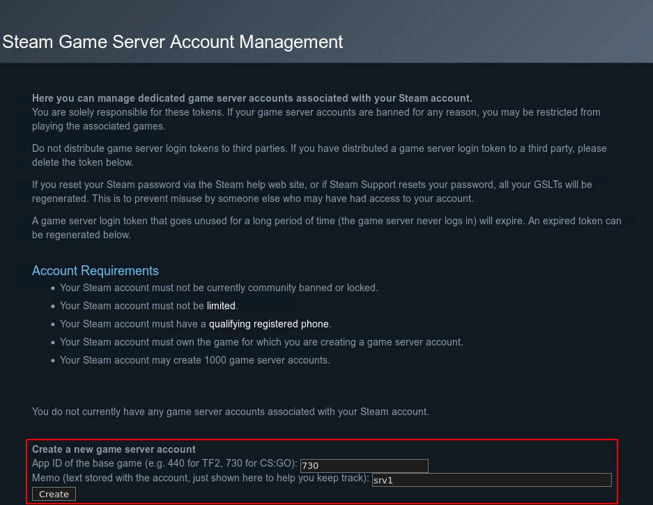

Algunas personas están interesadas en tener un servidor privado para poder jugar al CS GO con sus amigos. El proceso es sencillo de seguir.

## ¿Qué es necesario?

-   Un servidor
       - **Memoria**: Al menos 2GB de memoria RAM (Yo recomiendo 4GB)
       - **Disco duro**: Al menos 15GB de espacio en disco
       - **Arquitectura de CPU**: x86 (ARM no está soportado)
-   Una cuenta de Valve

## Crear un nuevo usuario

Lo primero, es importante crear un nuevo usuario en Linux para evitar que el servidor de CSGO sea hackeado y que afecte a tu nodo Linux.

```
root|venice:~$ adduser csgo
Adding user `csgo' ...
Adding new group `csgo' (1001) ...
Adding new user `csgo' (1001) with group `csgo' ...
New password: 
Retype new password: 
passwd: password updated successfully
Changing the user information for csgo
Enter the new value, or press ENTER for the default
        Full Name []: 
        Room Number []: 
        Work Phone []: 
        Home Phone []: 
        Other []: 
Is the information correct? [Y/n] y
```

Una vez creado el usuario, logeate en una nueva sesión con este usuario.

```
root|venice:~$ su - csgo
csgo|venice:~$ 
```

## SteamCMD

SteamCMD is una versión de línea de comandos del cliente del cliente de Steam que es necesario si quieres alojar un juego de Steam en tu propio servidor de juegos.

### Instalar SteamCMD

El primer paso es instalar las cabeceras y los ficheros de librerias estáticas necesario para construir programas en C. Tras ello, ya podemos instalar SteamCMD.


```
csgo|venice:~$ sudo apt-get install lib32gcc-s1

csgo|venice:~$ `mkdir ~/Steam && cd ~/Steam`

csgo|venice:~$ wget https://steamcdn-a.akamaihd.net/client/installer/steamcmd\_linux.tar.gz

csgo|venice:~/Steam$ tar -xvzf steamcmd\_linux.tar.gz
steamcmd.sh
linux32/steamcmd
linux32/steamerrorreporter
linux32/libstdc++.so.6
linux32/crashhandler.so
csgo|venice:~/Steam$
```

### Iniciar SteamCMD

El siguiente paso es ejecutar **SteamCMD** para instalar el servidor de CS GO.

```
csgo|venice:~/Steam$ screen ~/Steam/steamcmd.sh
[ 17%] Downloading update (11.480 of 51.570 KB)…
[ 22%] Downloading update (13.925 of 51.570 KB)…
[ 27%] Downloading update (16.377 of 51.570 KB)…
[ 31%] Downloading update (18.822 of 51.570 KB)…
[ 36%] Downloading update (21.309 of 51.570 KB)…
[ 41%] Downloading update (23.810 of 51.570 KB)…
[ 46%] Downloading update (26.307 of 51.570 KB)…
[ 51%] Downloading update (29.064 of 51.570 KB)…
[ 56%] Downloading update (31.598 of 51.570 KB)…
[ 61%] Downloading update (32.848 of 51.570 KB)…
[ 63%] Downloading update (34.093 of 51.570 KB)…
[ 66%] Downloading update (35.341 of 51.570 KB)…
[ 68%] Downloading update (36.583 of 51.570 KB)…
[ 70%] Downloading update (37.959 of 51.570 KB)…
[ 73%] Downloading update (39.206 of 51.570 KB)…
[ 76%] Downloading update (40.447 of 51.570 KB)…
[ 78%] Downloading update (41.699 of 51.570 KB)…
[ 80%] Downloading update (43.080 of 51.570 KB)…
[ 83%] Downloading update (44.342 of 51.570 KB)…
[ 85%] Downloading update (45.594 of 51.570 KB)…
[ 88%] Downloading update (46.847 of 51.570 KB)…
[ 90%] Downloading update (48.229 of 51.570 KB)…
[ 93%] Downloading update (49.479 of 51.570 KB)…
[ 95%] Downloading update (50.723 of 51.570 KB)…
[ 98%] Downloading update (51.570 of 51.570 KB)…
[100%] Download Complete.
[----] Applying update…
[----] Extracting package…
[----] Extracting package…
[----] Extracting package…
[----] Extracting package…
[----] Installing update…
[----] Installing update…
[----] Installing update…
[----] Installing update…
[----] Installing update…
[----] Installing update…
[----] Installing update…
[----] Installing update…
[----] Cleaning up…
[----] Update complete, launching…
Redirecting stderr to '/home/csgo/Steam/logs/stderr.txt'
/tmp/dumps insufficient permissions - delete and recreate
[ 0%] Checking for available updates…
[----] Verifying installation…
[ 0%] Downloading update…
[ 0%] Checking for available updates…
[----] Download complete.
[----] Extracting package…
[----] Extracting package…
[----] Extracting package…
[----] Extracting package…
[----] Installing update…
[----] Installing update…
[----] Installing update…
[----] Installing update…
[----] Installing update…
[----] Installing update…
[----] Installing update…
[----] Installing update…
[----] Cleaning up…
[----] Update complete, launching Steamcmd…
Redirecting stderr to '/root/Steam/logs/stderr.txt'
[ 0%] Checking for available updates…
[----] Verifying installation…
Steam Console Client (c) Valve Corporation
-- type 'quit' to exit --
Loading Steam API…OK.

Steam>
```

Una vez iniciado SteamCMD, nos tenemos que logear en Steam. Podría ser de forma anónima, para la instalación es suficiente.

```
Steam>login anonymous

Connecting anonymously to Steam Public…Logged in OK
Waiting for user info…OK

Steam>
```

El siguiente paso es seleccionar el directorio de instalación (En nuestro caso _/home/csgo/csgo-ds_)

```
Steam>force_install_dir ./csgo-ds
```

Y finalmente, el comando para instalar el servidor CSGO desde SteamCMD.

```
Steam>app_update 740 validate
Update state (0x3) reconfiguring, progress: 0.00 (0 / 0)
Update state (0x3) reconfiguring, progress: 0.00 (0 / 0)
Update state (0x61) downloading, progress: 0.09 (23907768 / 27757647100)
Update state (0x61) downloading, progress: 0.30 (83559997 / 27757647100)
...
Update state (0x61) downloading, progress: 99.73 (27683929580 / 27757647100)
Update state (0x61) downloading, progress: 99.82 (27706657340 / 27757647100)
Update state (0x61) downloading, progress: 99.95 (27742929007 / 27757647100)
Success! App '740' fully installed.
Steam>quit
csgo|venice:~/Steam$ 
```

## Primer inicio de tu servidor CS GO

Ahora el Counter-Strike: Global Offensive se ha instalado con éxito y podemos hacer una ejecución de prueba. Con el siguiente comando iniciaremos el servidor con el modo _Classic Casual_ y el Mapgroup _mg\_bomb_ iniciando el mapa _de\_mirage_.

```
csgo|venice:~/Steam$ cd csgo-ds
csgo|venice:~/Steam/csgo-ds$ ./srcds_run -game csgo -console -usercon +game_type 0 +game_mode 0 +mapgroup mg_bomb +map de_mirage
```

Obtendrás un montón de salidas, es normal y muestra que el software esta funcionando. Al final, tendrás estas líneas:

```
****************************************************
*                                                  *
*  No Steam account token was specified.           *
*  Logging into anonymous game server account.     *
*  Connections will be restricted to LAN only.     *
*                                                  *
*  To create a game server account go to           *
*  http://steamcommunity.com/dev/managegameservers *
*                                                  *
****************************************************
```

Esto significa que tu servidor no está registrado en Valve. Mientras no registres tu servidor en Valve, sólo podrás conectar tu servidor a través de LAN, no a través de Internet. Nunca será un servidor oficial para jugar. Para hacer tu servidor disponible a través de internet, necesitas realizar el siguiente paso _(Puedes terminar la sesión actual con la combinación CTRL+C)_.

## Registra tu servidor

Para registrar tu servidor de CS:GO en Valve y hacerlo disponile para jugar a través de internet, tienes que registrar el servidor directamente en Valve. Para ello, visita el siguiente link: [Steam Server management](http://steamcommunity.com/dev/managegameservers). Logéate con tus credenciales de Steam (si no lo estás ya) y mete el número _730_ como el App ID en el primer cuadro de texto. El segundo cuadro de texto puede ser rellenado con lo que quieras, es sólo un campo de comentarios. Por ejemplo, si tienes más de un servidor podrías escribir el hostname aquí para que puedas ver cuando quieras a qué servidor pertenece cada token. Haz click en _Create_ para obtener tu Token:



Necesitarás usar este token como la variable _YOUR\_GLST_ en el script de lanzamiento en los siguientes pasos.

## Configura el servidor

El primer paso es crear el ficher ode configuración _server.cfg_ con tu editor de texto preferido, en mi caso, vi:

    csgo|venice:~$ vi ~/Steam/csgo-ds/csgo/cfg/server.cfg

Y entonces insertar esta configuración con los valores correctos:

```
hostname "The name of your CS:GO server"
sv_password "server_password"
sv_timeout 60
rcon_password "rcon_password"
mp_autoteambalance 1
mp_limitteams 1
writeid
writeip
```

*   `sv_password` es la contraseña que los usuarios necesitarán utilizar para entrar y unirse al servidor.
*   `rcon_password` es la contraseña [RCON](https://developer.valvesoftware.com/wiki/Source_RCON_Protocol), que es usada para controlar remotamente el servidor desde el propio cliente del juego.

Después de esto, tenemos que crear un script de inicio para el CS:GO con los siguientes comandos. Crea el fichero `startcsgo.sh` y guárdalo en el directorio home de tu usuario `csgo`. Establece el valor de la variable `YOUR_GSLT` en la parte de más arriba para ser tu token para loguearse en el servidor. Establece el valor de la variable `CSGO_INSTALL_LOCATION` de acuerdo a la tabla de más abajo.


    csgo|venice:~$ vi ~/startcsgo.sh

y despúes añade:


```
#!/bin/sh

YOUR_GSLT=
YOUR_PUBLIC_IP=
CSGO_INSTALL_LOCATION=/home/csgo/Steam/csgo-ds

cd $CSGO_INSTALL_LOCATION
screen -S "Counter-Strike: Global Offensive Server" ./srcds_run -game csgo +ip $YOUR_PUBLIC_IP -usercon +game_type 0 +game_mode 1 +mapgroup mg_hostage +map de_mirage +sv_setsteamaccount $YOUR_GSLT -net_port_try 1
```

Haz el script ejecutable:

    csgo|venice:~$ chmod +x ~/startcsgo.sh

## Lanza el servidor

    csgo|venice:~$ cd ~ && ./startcsgo.sh

## Únete al juego

1.  Ejecuta Counter-Strike: Global Offensive.
2.  Una vez ejecutado, ve a **Jugar** y haz click en **Navegar por Servidores Comunitarios**.
3.  Haz click en la pestaña **Favoritos** y entonces haz click en "**Añadir un servidor**" en la parte de abajo.
4.  Escribe la dirección IP del servidor y haz click en "**Añadir esta dirección a mis favoritas**".
5.  Enttrás en tu nuevo servidor Counter-Strike: Global Offensive. Haz click en **Conectar** abajo a la derecha y empieza a disparar.
