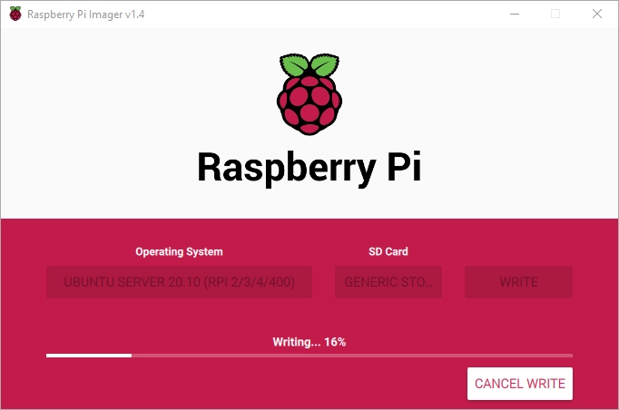
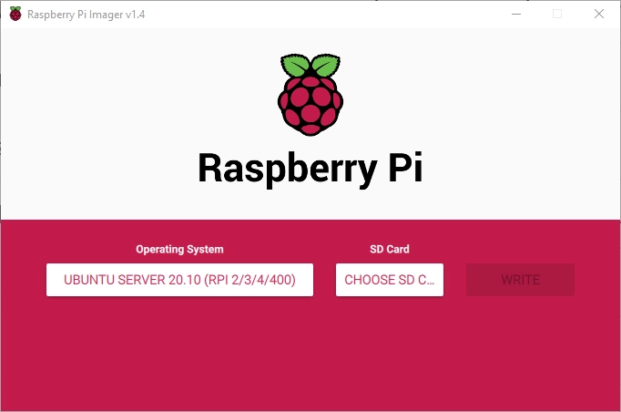
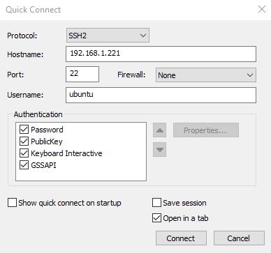
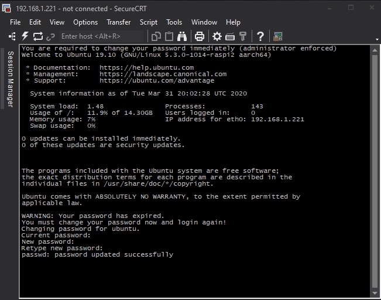

To install [Ubuntu](https://ubuntu.com/) in your Raspberry Pi 4 what you need is:

*   Raspberry Pi 4
*   USB-C cable
*   Mini SD Card (recommended 16 Gb or more)
*   PC
*   Mini SD Card reader in your PC
*   [RJ45 Ethernet cable](https://en.wikipedia.org/wiki/Modular_connector#8P8C)
*   Switch or Router of your network

The first step is to install Ubuntu software in your SD Card. For this, you shoud go to the [Raspberry Pi Downloads page](https://www.raspberrypi.org/downloads), and download the **Raspberry Pi Imager**.

Once installer the imager, it is needed to select the Operating System (In our case Ubuntu 20.10), and the SD Card. It is **important** to select _Ubuntu Server_ version instead of _Ubuntu Desktop_ version, because with _Desktop_ version it is needed a keyboard and a screen.



And then you can **write** the software in the SD Card.



Once installed the Operating System in the Mini SD Card, your Raspberry is ready to boot. Insert the Mini SD in the Raspberry Pi, plug an RJ45 cable to the switch or router of your network, and connect the USB-C cable to the power. After this, your Raspberry Pi will start.

## Find the Raspberry Pi in your network

In order to avoid the use of screen or keyboard connected to the Raspberry, it will be needed to have access to the router of your network and search the IP address given by the router with the DHCP protocol.

As an alternative, you could use a Linux terminal connected in your network and use nmap tool to find the IP address.

    sudo nmap -sP 192.168.1.0/24

This command will return all the devices connected in your network. In my case I found my Raspberry with the IP Address **192.168.1.221** and a MAC starting with **DC:A6:32**.

```
$ sudo nmap -sP 192.168.1.0/24
 Starting Nmap 7.40 ( https://nmap.org ) at 2020-03-31 21:27 CEST
 Nmap scan report for 192.168.1.221
 Host is up (0.00077s latency).
 MAC Address: DC:A6:32:XX:XX:XX (Unknown)
```

## Connect with SSH to your Raspberry Pi

Finally, you can use an SSH client to connect to your Raspberry Pi. Credentials at first connection are ubuntu / ubuntu. In the first login, the system will ask you to change the password.

In my case, I used my loved [SecureCRT](https://www.vandyke.com/products/securecrt) SSH client in Windows.






And that's all! Now, you have full access via SSH to your Raspberry Pi 4.
