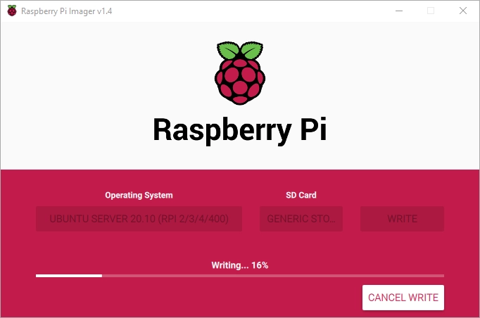
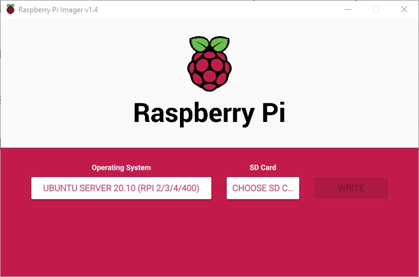
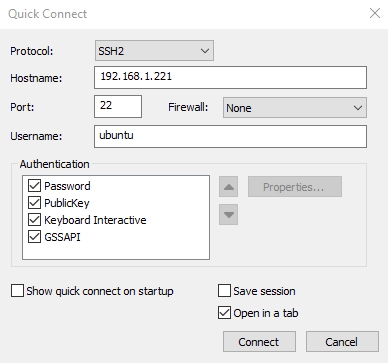
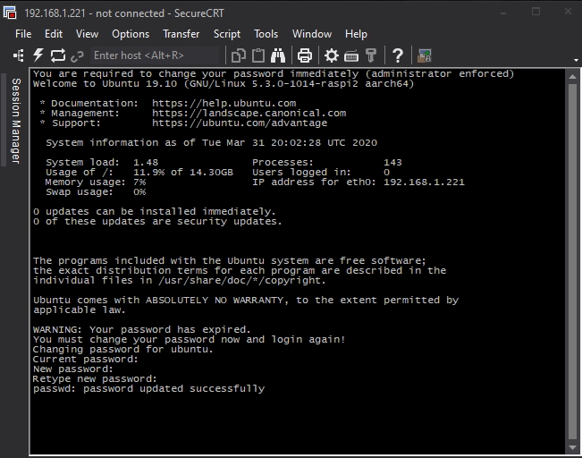
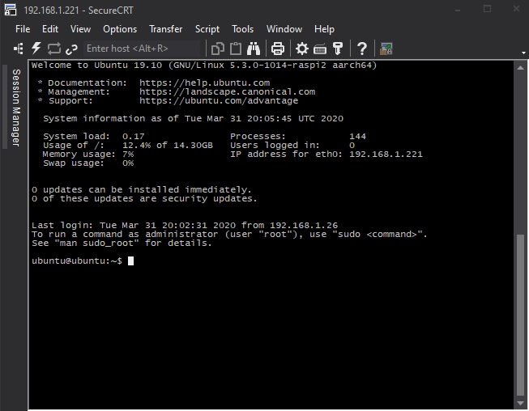

Para instalar [Ubuntu](https://ubuntu.com/) en tu Raspberry Pi 4 lo que necesitas es:

*   Raspberry Pi 4
*   Cable USB-C
*   Tarjeta Mini SD (Recomendados 16Gb o más)
*   PC
*   Lector de tarjetas Mini SD en tu PC
*   [Cable Ethernet RJ45](https://en.wikipedia.org/wiki/Modular_connector#8P8C)
*   Switch o Router de tu red local

El primer paso es instalar el software de Ubuntu en tu tarjeta Mini SD. Para ello, debes de ir a la [página de descargas de Raspberry Pi](https://www.raspberrypi.org/downloads), y descarga **Raspberry Pi Imager**.

Una vez instalado el imager, is necesario seleccionar el Sistema Operativo (En nuestro caso Ubuntu 20.10) y la tarjeta SD. Es **importante** seleccionar la versión _Ubuntu Server_ en lugar de la versión _Ubuntu Desktop_, ya que la versión _Desktop_ es necesario teclado y pantalla.



Y entonces puedes **escribir** el software en la tarjeta SD.



Una vez instalado el sistema operativo en la tarjeta Mini SD, tu Raspberry está lista para arrancar. Inserta la tarjeta Mini SD en tu Raspberry Pi, enchufa el cable RJ45 al switch o router de tu red local, y conecta el cable USb-C al enchufe de energía. Tras esto, tu Raspberry Pi arrancará.

## Encuentra tu Raspberry Pi en tu red

Para evitar el uso de pantalla y teclado conectado a la Rasperry, sera necesario tener acceso al router de tu red y buscar la dirección IP asignada por el router con el protocolo DHCP.

Como alternativa, podrias utilizar un terminal de Linux conectada en tu red local y utiliza la herramienta **nmap** para encontrar la dirección IP.

    sudo nmap -sP 192.168.1.0/24

Este comando te devolvera todos los dispositivos conectados en tu red local. En mi caso, encontré my Raspberry con la dirección IP **192.168.1.221** y una MAC empezando con **DC:A6:32**.

```
$ sudo nmap -sP 192.168.1.0/24
 Starting Nmap 7.40 ( https://nmap.org ) at 2020-03-31 21:27 CEST
 Nmap scan report for 192.168.1.221
 Host is up (0.00077s latency).
 MAC Address: DC:A6:32:XX:XX:XX (Unknown)
```

## Conecta con SSH a tu Raspberry Pi

Finalmente, puedes utilizar un cliente SSH para conectar a tu Raspberry Pi. Las credenciales en la primera conexión son ubuntu / ubuntu. En la primera conexión el sistema te pedirá cambiar la password.

En mi caso, he utilizado mi querido cliente SSH [SecureCRT](https://www.vandyke.com/products/securecrt) en Windows.







¡Y esto es todo! Ahora tendras acceso completo vía SSH a tu Raspberry Pi 4.
