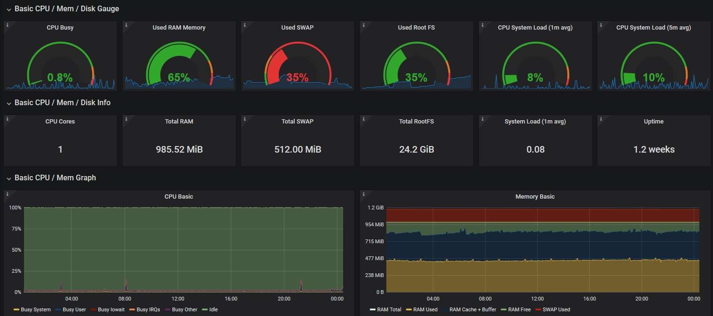
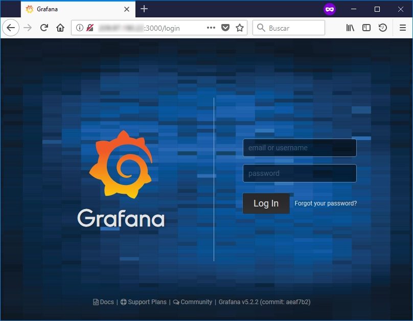
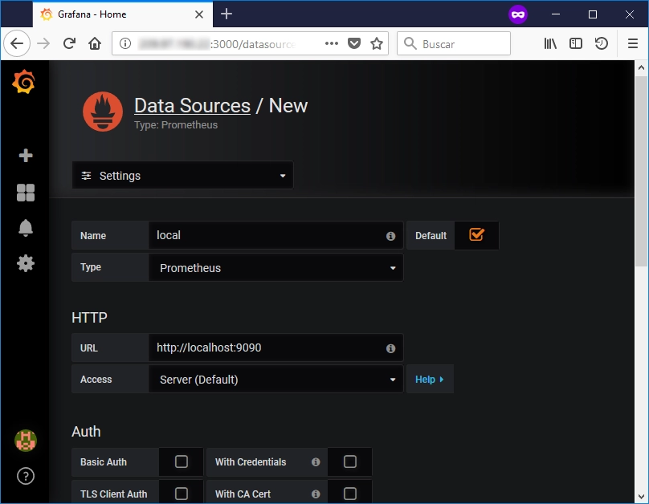
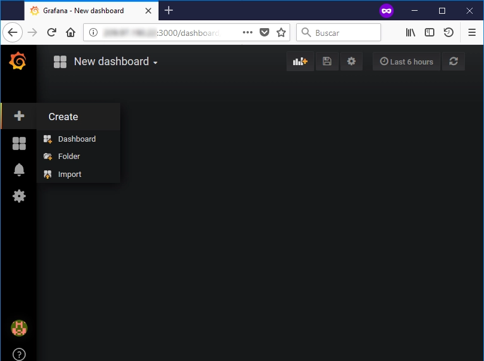
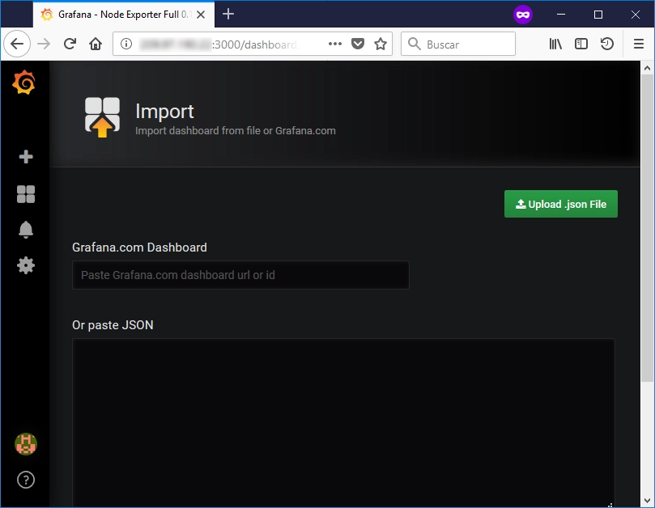
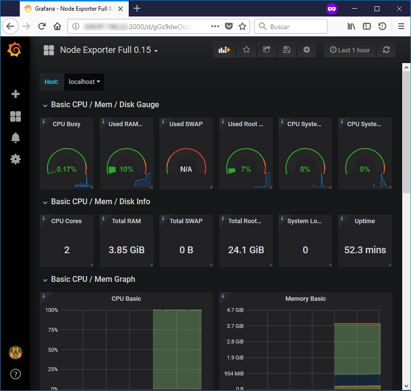

[Grafana](https://grafana.com) is an open source metric analytics & visualization tool which can help us to monitor the system with a nice Dashboard.

## Step 1: Installing Grafana

Grafana is available in the APT packages repository, however it could not be the latest version, so we'll use the official Grafana repository.

First, it is needed to create the file `/etc/apt/sources.list.d/grafana.list` and add the following into it:

    deb https://packages.grafana.com/oss/deb stable main

There is a separate repository for beta releases:

    deb https://packages.grafana.com/oss/deb beta main

Then it is needed to add the GPG Key, in order to install signed packages:

    $ curl https://packages.grafana.com/gpg.key | sudo apt-key add -

Refresh your APT cache to update your package lists.

    $ sudo apt update

Then make sure Grafana will be installed from the official repository.

    $ apt-cache policy grafana

Now, we can proceed with the installation of Grafana.

    $ sudo apt install grafana

Once installed, now we can start it.

    $ sudo systemctl start grafana-server

We should check now Grafana has started OK (`active (running)`).

    $ sudo systemctl status grafana-server

And finally, enable Grafana to start at boot time.

    $ sudo systemctl enable grafana-server.service

## Step 2: Installing Prometheus

[Prometheus](https://prometheus.io) is an open-source systems monitoring and alerting toolkit. We are going to use the APT tool to install it:

    $ sudo apt-get install prometheus prometheus-node-exporter

After this, we should check we have 2 new TCP connections listen on port 9090 and 9100.

    $ netstat -plunt

Also, we could see that on port 3000 it is listening Grafana.

## Step 3: Login into the system

Once installed Grafana & Prometheus, you can access Grafana site from a Web Browser. The URL is the IP address of the web server (or the domain), and the port is the 3000. The first page you should see is this.

You can login with the _admin/admin_ credentials. Once logged, you have to change the password of the admin account.

## Step 4: Setting up the Prometheus Data Source

Grafana needs to add new data sources.

## Step 5: Creating the new Dashboard

Grafana has lots of Grafana Dashboards created by different users which are shared in the [Grafana Dashboard](https://grafana.com/dashboards) URL. I use the "[Node Exporter Full](https://grafana.com/dashboards/7039)" Dashboard, so I only have to add the **7039** ID in the import Dashboard tool of Grafana.

**Update (2019-Feb):** As Prometheus-node-exporter has been updated (0.15.2), and some counters has changed, so it is needed to use another Grafana Dashboard. I recommed to use the [**5174**](https://grafana.com/grafana/dashboards/5174) ID.

**Update (2020-May):** Again a new update of prometheus-node-exporter (0.18.1), and some counters have changed, so I used a different Grafana Dashbord: [**1860**](https://grafana.com/grafana/dashboards/1860) ID.

And finally, we have the Dashboard created with several statistics to monitor our server.

---

References:

*   [http://docs.grafana.org/installation/debian](http://docs.grafana.org/installation/debian)
*   [https://prometheus.io/docs/guides/node-exporter](https://prometheus.io/docs/guides/node-exporter)
*   [https://grafana.com/dashboards/7039](https://grafana.com/dashboards/7039) (For prometheus-node-exporter 0.15)
*   [https://grafana.com/dashboards/5174](https://grafana.com/dashboards/5174) (For prometheus-node-exporter 0.16)
*   [https://grafana.com/dashboards/1860](https://grafana.com/dashboards/1860) (For prometheus-node-exporter 0.18 or newer)
