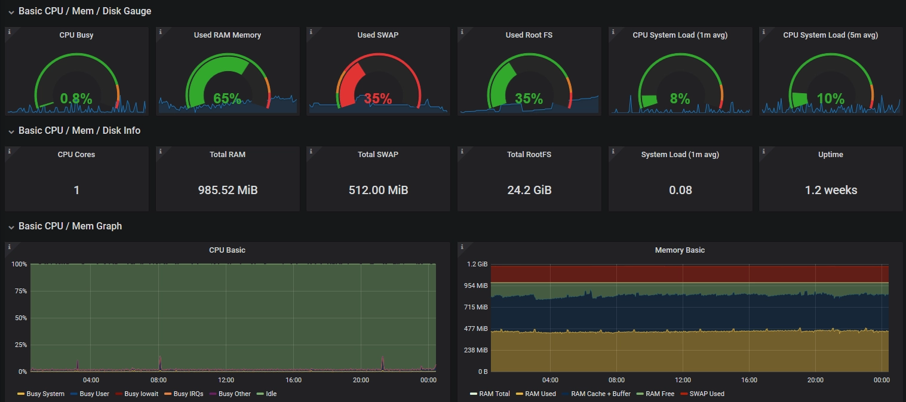
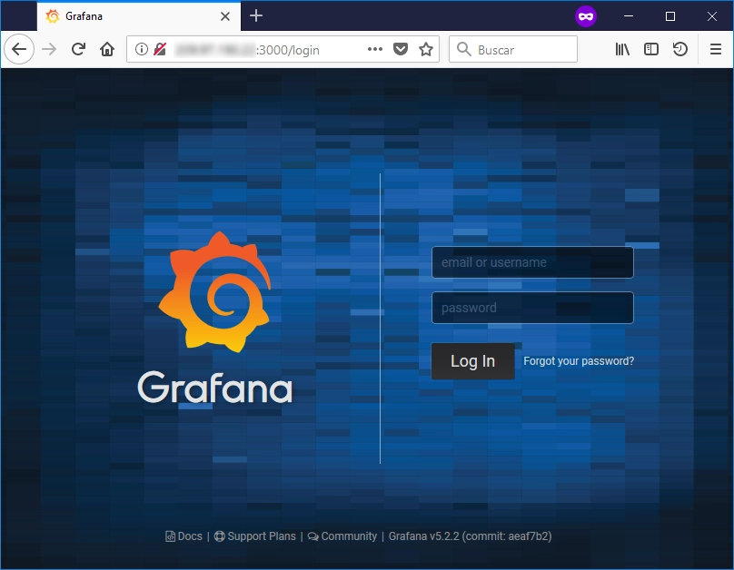
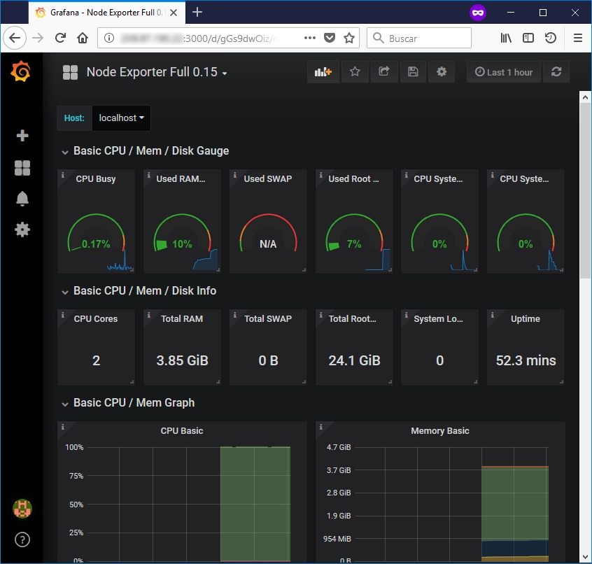

[Grafana](https://grafana.com) es una herramienta open source analizador y visualizador que nos puede ayudar a monitorizar el sistema con un agradable Dashboard.

## Paso 1: Instalar Grafana

Grafana está disponible en el repositorio de los paquetes APT, sin embargo podria no ser la última versión, asi que usaremos el repositorio oficial de Grafana.

Lo primero, es necesario crear el fichero `/etc/apt/sources.list.d/grafana.list` y añadir lo siguiente en él:

    deb https://packages.grafana.com/oss/deb stable main

Hay un repositorio seperado para versiones beta:

    deb https://packages.grafana.com/oss/deb beta main

Ahora es necesario añadir la llave GPG, para instalar paquetes firmados:

    $ curl https://packages.grafana.com/gpg.key | sudo apt-key add -

Actualizatu cache APT para actualizar el listado de paquetes.

    $ sudo apt update

Ahora asegúrate de que Grafana se instalara desde el repositorio oficial.

    $ apt-cache policy grafana

Ya podemos proceder con la instalación de Grafana.

    $ sudo apt install grafana

Una vez instalado, podemos iniciarlo.

    $ sudo systemctl start grafana-server

Debemos de chequear que Grafana ha iniciado de formado correcta (`active (running)`).

    $ sudo systemctl status grafana-server

Y finalmente, habilita Grafana para iniciar en el arranque del sistema.

    $ sudo systemctl enable grafana-server.service

## Paso 2: Instalar Prometheus

[Prometheus](https://prometheus.io) es un sistema open-soruce de monitorización y alerta. Vamos a usar la herramienta APT para instalarlo:

    $ sudo apt-get install prometheus prometheus-node-exporter

Tras esto, deberíamos de chequear que tenemos 2 nuevas conexiones TCP escuchando en el puerto 9090 y 9100.

    $ netstat -plunt

También, deberiamos de ver que en el puerto 3000 esta escuchando Grafana.

## Paso 3: Logéate en el sistema

Una vez instalado Grafana & Prometheus, puedes acceder a la web de Grafana desde un navegador web. La URL es la dirección IP del servidor web (o el dominio), y el puerto es el 3000. La primera página que deberías de ver es ésta.

Te puedes logear con las credenciales _admin/admin_ credentials. Una vez logeado, tienes que cambiar la password del usuario admin.

## Paso 4: Configurando el Data Source de Prometheus

Grafana necesita añadir nuevos Data Sources.

## Paso 5: Creando el nuevo Dashboard

Grafana tiene muchos Dashboards creados por diferentes usuarios y están compartidos en la URL [Grafana Dashboard](https://grafana.com/dashboards). Yo utilizo el Dashboard "[Node Exporter Full](https://grafana.com/dashboards/7039)", así que sólo tengo que añadir el ID **7039** en la herramiento de importar Dashboards de Grafana.

**Actualización (2019-Feb):** Como Prometheus-node-exported ha sido actualizado (0.15.2), y algunos contadores han cambiado, es necesario utilizar otro Dashboard de Grafana. Yo recomeidno usuar el ID [**5174**](https://grafana.com/grafana/dashboards/5174).

**Actualización (2020-May):** De nuevo, una nueva actualiazción de prometheus-node-exporter (0.18.1), y algunas contadores han vuelto a cambiar, asi que ahora utilizo un Dashboard de Grafana diferente (ID): [**1860**](https://grafana.com/grafana/dashboards/1860).

Y finalmente, hemos creado un Dashboard con varias estadísticas a monitorizar nuestro servidor.

---

Fuentes:

*   [http://docs.grafana.org/installation/debian](http://docs.grafana.org/installation/debian)
*   [https://prometheus.io/docs/guides/node-exporter](https://prometheus.io/docs/guides/node-exporter)
*   [https://grafana.com/dashboards/7039](https://grafana.com/dashboards/7039) (Para prometheus-node-exporter 0.15)
*   [https://grafana.com/dashboards/5174](https://grafana.com/dashboards/5174) (Para prometheus-node-exporter 0.16)
*   [https://grafana.com/dashboards/1860](https://grafana.com/dashboards/1860) (Para prometheus-node-exporter 0.18 o superior)
