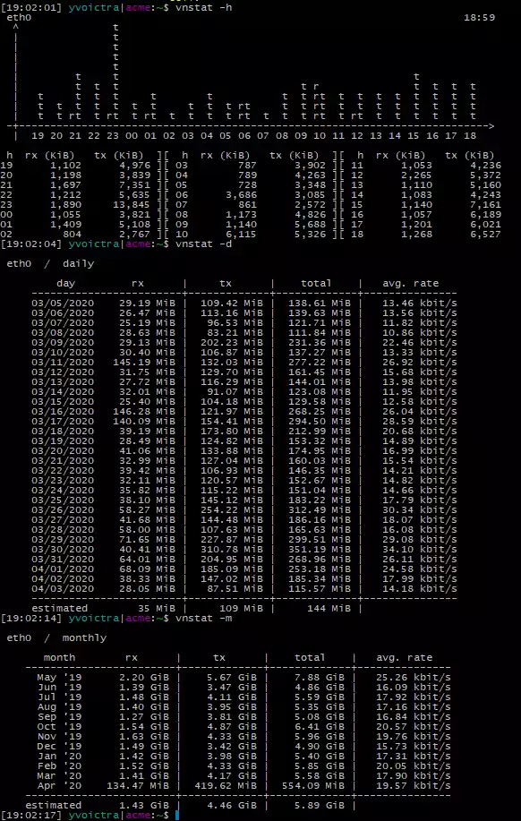

Monitorizar el **tráfico de red** o **uso de ancho de banda** es algo indispensable en las actividades de un SysAdmin. Hay muchas herramientas diferentes para gestionar esta monitorización, pero una de mis favoritas en **vnStat**. La principal ventaja de esta herramienta es la simplicidad de su uso.

## Instalación

Con Ubuntu, la forma de instalar esta herramiento es con **apt**.

    sudo apt install vnstat

## Primeros pasos

Una vez instalado, es importante conocer qué interfaces van a ser monitorizados. Para ello, puedes utilizar el siguiente comando

    netstat -i

En mi caso, tengo 2 interfaces (eth0, wlan0). El interfaz **lo** es el _[interfaz de loopback](https://en.wikipedia.org/wiki/Loopback#Virtual_loopback_interface)_, y éste no se monitoriza.

```
yvoictra|zoar:~$ netstat -i
Kernel Interface table
Iface MTU RX-OK RX-ERR RX-DRP RX-OVR TX-OK TX-ERR TX-DRP TX-OVR Flg
eth0 1500 0 0 0 0 0 0 0 0 BMU
lo 65536 58 0 0 0 58 0 0 0 LRU
wlan0 1500 12521 0 1 0 1962 0 0 0 BMRU
```

Entonces, puedes chequear si las bases de datos se han creado. Hay un demonio actualizando la base de datos cada 5 minutos.

```
yvoictra|zoar:~$ ls -ltr /var/lib/vnstat/
total 8
-rw-r--r-- 1 vnstat vnstat 2784 Apr 3 18:35 wlan0
-rw-r--r-- 1 vnstat vnstat 2784 Apr 3 18:35 eth0
```

## Cómo usarlo

Puedes forzar una actualización con este comando

    vnstat -u

Y para ver estadísticas hay muchas opciones, aquí tienes algunas de ellas:

*   `d:` Daily statistics for the last 30 days.
*   `m:` Monthly statistics for the past 12 months.
*   `w:` Statistics for the last 7 days, and the current and previous week.
*   `h:` Hourly statistics for the last 24 hours.
*   `t:` Top 10 days with the highest traffic.

Aquí un ejemplo de la salida



## Conclusión

vnStat es una potente herramienta con múltiples opciones de control de tráfico gestionado por una máquina. Desde mi punto de vista, debe de ser instalado en cada máquina conectada a Internet.
